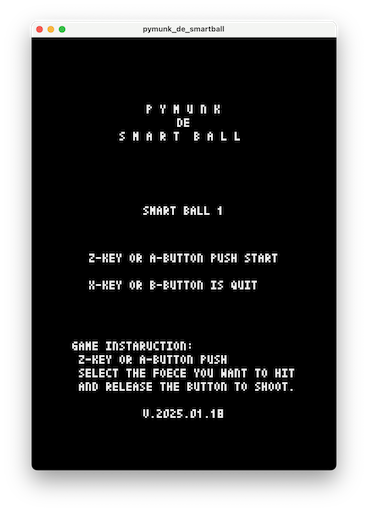
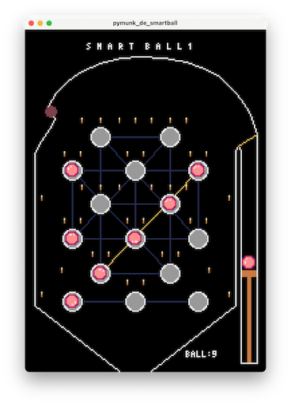

# pymunk_de_smartball
## 注釈
Pyxel version 2.3.0にしたときはWeb版が動作していましたが、1/24現在動作しなくなりました。  
なんらかのバージョンアップがなされたせいなのかもしれません。  
pymunkがロードできないエラーが出ています。  

## 概要
- pymunkライブラリを使ったスマートボールシミュレーター。
- 当たり判定は全てpymunkライブラリの衝突判定を使用しています。
- PERFECT目指してできるだけ少ないボール数でクリアしてください。
- 効果音は、frenchbreadさん作成の「Pyxel RPG SE パック」を使用しています。
- 裏技：一発目のボールを打つ時にYキーまたはYボタンでボールの色を変えられます。
- Web化するとバーチャルゲームパッドに対応できない・・・
- 台の種類を追加して３種類とした。

## 操作方法
Aボタン、または、Zキーでショット  
Bボタン、または、XキーでPyxel Quit  

## スクリーンショット
  
  
  
  

## GIFアニメ

## 動作確認
- [URL](https://sanbunno-ichi.github.io/pymunk_de_smartball/)
