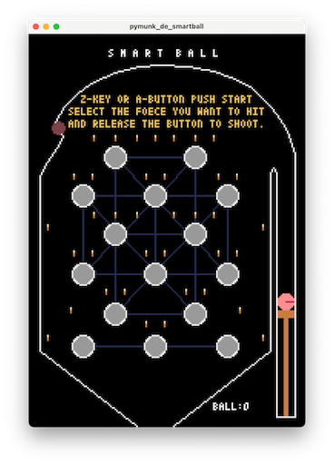
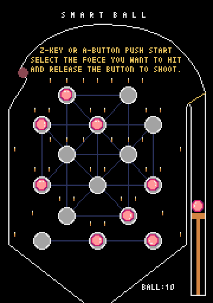

# pymunk_de_smartball
## 概要
- pymunkライブラリを使ったスマートボールシミュレーター。
- 当たり判定は全てpymunkライブラリの衝突判定を使用しています。
- PERFECT目指してできるだけ少ないボール数でクリアしてください。
- 効果音は、frenchbreadさん作成の「Pyxel RPG SE パック」を使用しています。
- 裏技：一発目のボールを打つ時にYキーまたはYボタンでボールのデザインを変えられます。

## 操作方法
Aボタン、または、Zキーでショット  
Bボタン、または、XキーでPyxel Quit  

## スクリーンショット

## GIFアニメ

## 動作確認
- [URL](https://sanbunno-ichi.github.io/pymunk_de_smartball/)
